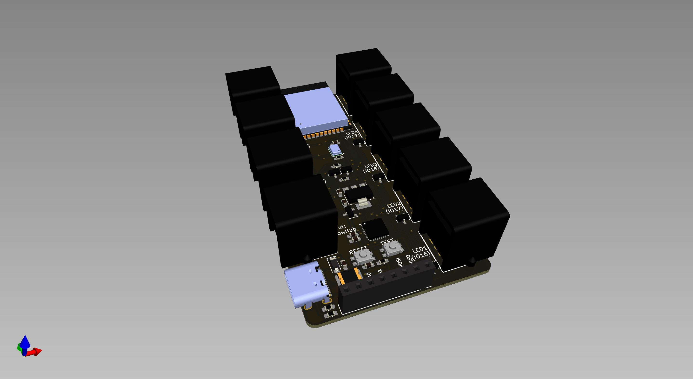
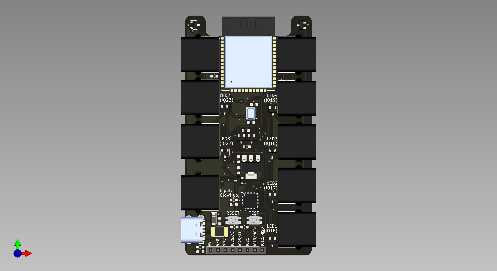
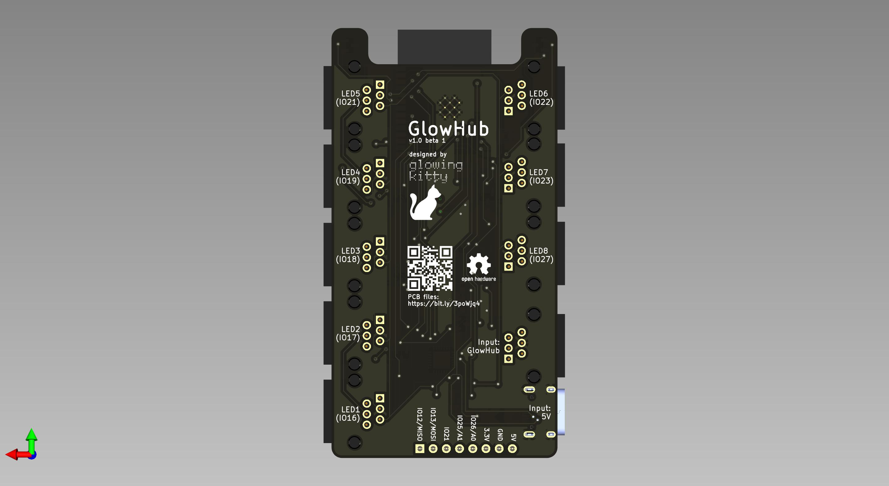

# GlowHubPCB

The PCB for GlowHub, to control up to 8 LED lamps at the same time.

## Links

- [Schematic](https://github.com/glowingkitty/GlowHub/blob/main/GlowHubPCB/GlowHubPCB.pdf)
- [Interactive BOM](https://htmlpreview.github.io/?https://github.com/glowingkitty/GlowHub/blob/main/GlowHubPCB/bom/ibom.html)