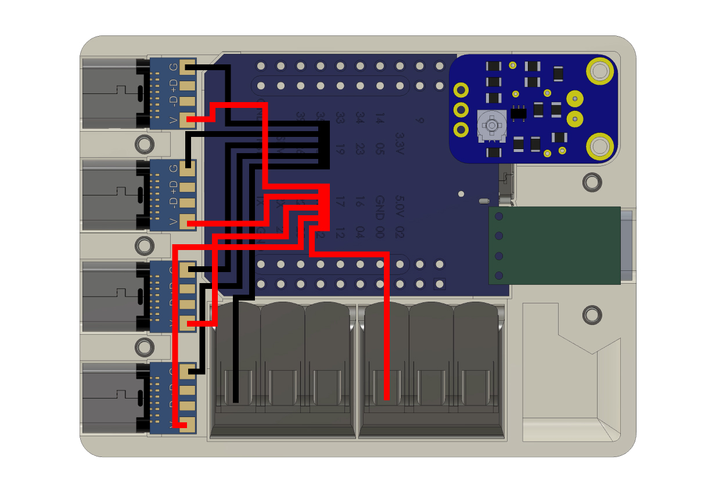
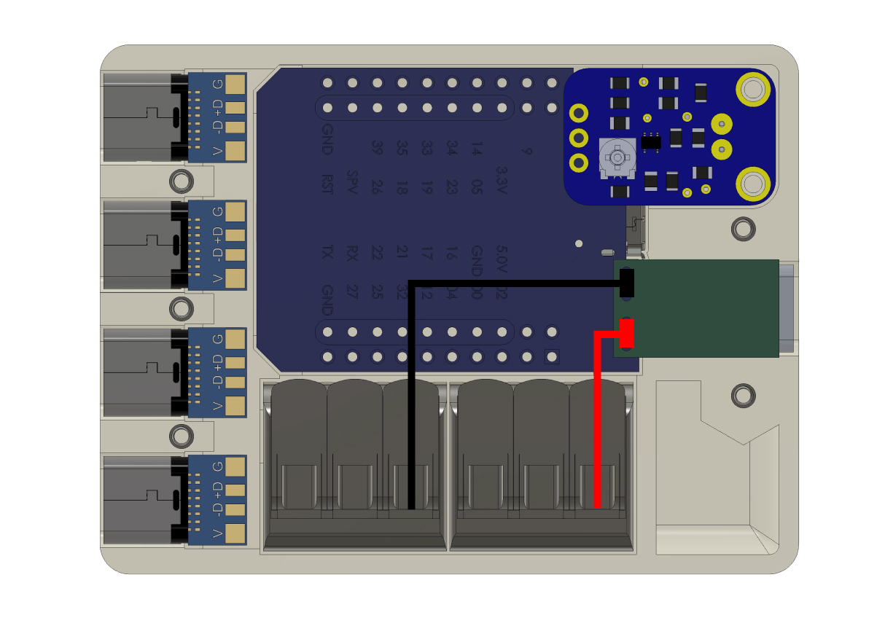

## What is this project?

The control unit for powering and controlling up to 4 [GlowTubes](https://github.com/glowingkitty/GlowTube) at the same time. Powered by an ESP32 D1 mini and WLED. Just connect your [GlowTube](https://github.com/glowingkitty/GlowTube) via a USB-C cable to one of the LED ports of GlowHub, plug in a USB-C power cable on the other side of GlowHub - and you are ready to let your LEDs glow!

Want to double-check if you are building it correctly? [Download the "GlowHub.step" file from GrabCAD](https://grabcad.com/library/glowhub-1)

## Required tools

- 3D printer (tested with MSLA 3d printer, but every other 3D printer should work as well. With a minimum print area of 12x9x5cm)
- screwdriver (for M2 screws)
- soldering equipment
- (recommended, but not required) crimp pliers

## Required materials

- **min. 50ml** of 3D printing resin (or similar amount of filament, if you use an FDM printer)
- **1x** ESP32 D1 Mini
- **1x** MAX4466 microphone
- **2x** WAGO 221-413 connector
- **4x** USB-C female connector JRC-B008
- **1x** USB-C PD board ZYPDS
- **5x** M2 nuts
- **5x** M2 12mm screws flat head
- wires (ideally in red, white or black, green)

## How to build the GlowHub

### **Step 1:** Print the parts

First, 3D print all the case parts in [/3D printed parts](https://github.com/glowingkitty/GlowHub/tree/main/3d%20printed%20parts), with an SLA/MSLA printer or FDM printer.

### **Step 2:** Prepare the ESP32

Connect your ESP32 D1 Mini via a micro-USB cable to your computer, open Chrome (yes, it needs to be Chrome/Chromium), visit [https://install.wled.me](https://install.wled.me), switch the selected version number to the latest "SoundReactive" version and click "Install". Once it's done, wait for the "WLED-AP" wifi to show up on your computer's wifi settings, connect to the "WLED-AP" wifi (default-password: "wled1234") and follow the setup process. Once you finished the setup, open the WLED interface, go to /settings/leds, scroll down to "Hardware setup" and make sure you have four LED strips: all "WS281x", all with "Count"=29, for the pins 22,21,17 and 16. Click on "Save" (at the top or bottom of the interface), then go to settings/sound and make sure under "Sound Input Pin Manager" the "Analog Input pin" is set to 34. That's it from a software perspective. Next: let's build the hardware.

### **Step 3:** Add nuts

First, add the M2 nuts to the top case. Ideally, fixate them with the help of some hot glue.

### **Step 4:** Add electronics

Next, place all the electronics in the top case.

### **Step 5:** Connect the USB-C LED ports with the ESP32

Now let's connect the USB-C ports for the LEDs / GlowTubes with the ESP32. Start by adding solder to all pads on the USB-C boards. And make sure the D- and D+ pads are connected with solder. Then take (ideally green) wires and connect the D-pads of the USB-C boards with the pins 22,21,17 and 16 of the ESP32.

### **Step 6:** Connect the USB-C LED ports with voltage & ground

To power the LED strips/GlowTubes, we now need to connect the V (voltage) pads of the USB-C boards with (ideally red) wires to the right WAGO connector. Take a separate (ideally red and thick) wire and solder all the other four USB-C voltage wires to it. For safety reasons, make sure to use heat shrink tubing around the soldering connection. Also, for improved safety - I suggest using crimp pliers for the fifth voltage wire before you then connect it to the WAGO connector. Repeat the same process with the (ideally black or white) G (ground) wires and the other WAGO connector.

### **Step 7:** Connect the ESP32 with voltage & ground

Solder the GND and 5V pads of the ESP32 to the correct WAGO connector.

### **Step 8:** Connect the microphone to the ESP32

Solder the V pad of the microphone with the 3.3V pad of the ESP32, the GND pad of the microphone with a GND pad of the ESP32, and the OUT pad of the microphone with the GPIO pad 34.

### **Step 9:** Connect the USB-C PD board to ground & voltage

And now the last part for finishing the electronics: connect the + (voltage) and - (ground) pads of the USB-C PD board to the WAGO connectors. Also here, for improved safety better use crimp pliers, to make sure the wires have a stronger connection to the WAGO connectors.

### **Step 10:** Close the case

Now add the other half of the case on top and screw it all together with the M2 12mm screws. 

Done! Your GlowHub is ready to be used with your GlowTubes!